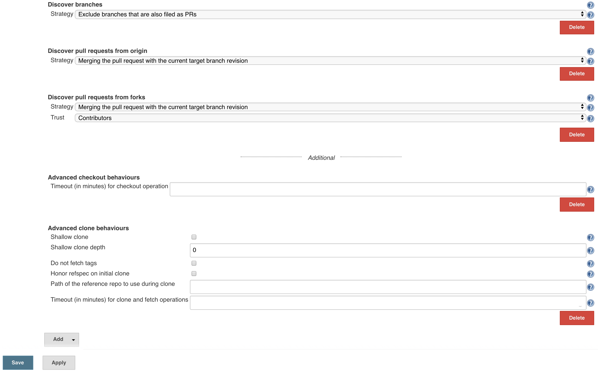

# Overview

We use Jenkins to implement our CI/CD pipeline. There is one Jenkins job for
each GitHub repository. Each job builds, tests and, then deploys an artifact
to Quay (e.g. a container for `solas-container` derived repositories, or a
chart for `solas-chart` derived repositories).

The following assumes a repository which has been duplicated according to
the instructions in the [README](../README.md). The [GitHub](./github.md)
and [Quay](./quay.md) instructions should have already been followed.

## Edit the [Jenkinsfile](../Jenkinsfile)

* Edit the `container_name` (or `image_name`), and `robot_secret` at the top of
the [Jenkinsfile](../Jenkinsfile).

  * For `solas-container` derived repositories:

```
def image_name            = "zabra-container";
def robot_secret          = "quay-robot-zabra-container-rw"
```

  The resulting container image will be deployed to the `quay.io` Container
  Repository at https://quay.io/application/samsung_cnct/zabra-container?namespace=samsung_cnct .

  * For `solas-chart` derived repositories:

```
def chart_name            = "zabra";
def robot_secret          = "quay-robot-zabra-rw"
```

  The resulting helm chart will be deployed to the `quay.io` App
  Repository at https://quay.io/application/samsung_cnct/zabra?namespace=samsung_cnct .

The secrets defined here were created during the [Quay](./quay.md) configuration.

## Edit the [Chart.yaml.in](../Chart.yaml.in) (solas-chart derived repositories only)

* Edit the `name`, `description`, `home`, and `sources`. Do not edit the `version`.

```
name: zabra
version: ${CHART_VER}-${CHART_REL}
description: Sample chart template for registry
keywords:
- kraken
home: https://github.com/samsung-cnct/chart-zabra
sources:
- https://github.com/samsung-cnct/chart-zabra
```

Also add any relevant keywords. For inspiration you should look at other
related charts. For example, if you are creating a logging chart, you might
look at https://github.com/samsung-cnct/chart-fluent-bit.

## Configure Jenkins

### Login and create the project

* Log in to your Jenkins server.

* Create a new project by selecting `New Item` on the Jenkins Homepage
  * Enter the name of this repository in the field at the top, for example, `container-zabra` or `chart-zabra`
  * Set the project to `Public`
  * Select Multibranch Pipeline 

### Add GitHub configuration

* Under `Branch Sources`, select `Add Source`

* Select Github

* _Select an entry under "Credentials", e.g. "Samsung CNCT Jenkins Bot/******"_
  * Once you add this, you may need to go back and actually select it.
* _Set an owner, e.g. `samsung-cnct`_
  * Using anonymous access to github may result in throttling
* _Select your repository, e.g. "container-zabra", "chart-zabra", etc._
* _Under the GitHub branch source, add the additional behaviors "Advanced
checkout behaviors" and "Advanced clone behviors", but do not change their
settings._



### Remember to select `Save`
