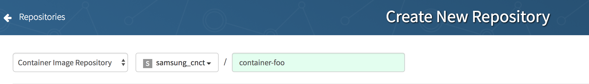
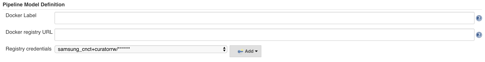

# Jenkins CI/CD Build and Deploy

Having cloned this repo to create a new chart using the [README](../README.md)
instructions at, edit the Jenkinsfile and Chart.yaml.in (for charts).

### Jenkinsfile

#### For Container Jenkinsfile:
*  Edit definition at the top:
```
project_name = "container-<project-name>"
```

#### For Chart Jenkinsfile
* Edit three definitions at the top:
```
def registry = "quay.io";
def registry_user = "samsung_cnct";
def chart_name = "<project-name>";
```

Replace each as needed. The chart_name should be the name of the chart you've added under the root of this git repo.

### Chart.yaml.in (Charts Repos only)

Edit this file to match your chart as needed. Do not alter the line starting with `version:`.

## Configure Jenkins

### Login and create the project

* Log in to your Jenkins server.
* Create a new project by selecting `New Item` on the Jenkins Homepage
  * Enter the name of this repo in the field at the top:
      * Chart `foo` will be named `foo`
      * Container `foo` will be named `container-foo`   
  * Set the Repo to `Public`

  

  * Select Multibranch Pipeline

   

### Add GitHub configuration
* Under `Branch Sources`, select `Add Source`
* Select Github
* _Select an entry under "Credentials", eg "Samsung CNCT Jenkins Bot/******"_
    * Once you add this, you may need to go back actually select it.
* _Set an owner, eg samsung-cnct_
  * Using anonymous access to github may result in throttling
* _Select your repository, eg "container-foo"_


### Add Registry Credentials to Pipeline Model definitions
Under pipeline model definition, add the registry credentials of your repo-specific robot.  



### Add quay.io application repository robot credentials

Easiest way to do this is to select an `Add` button on one of the source repositories `Credentials` lines

Per the Jenkinsfile, this credential should be set to `quay_credentials`

* Set the username to be the username of the robot - this is typically `group+robotname`
* Set the password to be the password of the robot - you can obtain this by reading the [quay instructions](quay.md)
* Set the ID to be `quay_credentials`


### Add Kubernetes Secret to Production Cluster for your robot
Go to https://quay.io/organization/samsung_cnct?tab=robots and find your robot.  
Click on Docker Configuration and then download the Docker credentials file for the robot account


** To work properly, you *must* rename that file to `config.json` **

Log in to the CNCT production cluster using [these](https://github.com/samsung-cnct/docs/blob/master/cnct/production-kubernetes-cluster.md) instructions.

Create a [Kubernetes Secret](https://kubernetes.io/docs/concepts/configuration/secret/) to bring this configuration into the cluster.
There are several methods that will work, a simple one is to run:
```
kubectl create secret generic samsung-cnct-quay-robot-<repo-name>cfg --namespace common-jenkins --from-file=./config.json
```

Then head to the Jenkinsfile for your repo, and edit the `podTemplate` `secretVolume` to have a `secretName` of `samsung-cnct-quay-robot-<repo-name>cfg`


### You're almost done

So select `Save` and let's configure [github](github.md)
